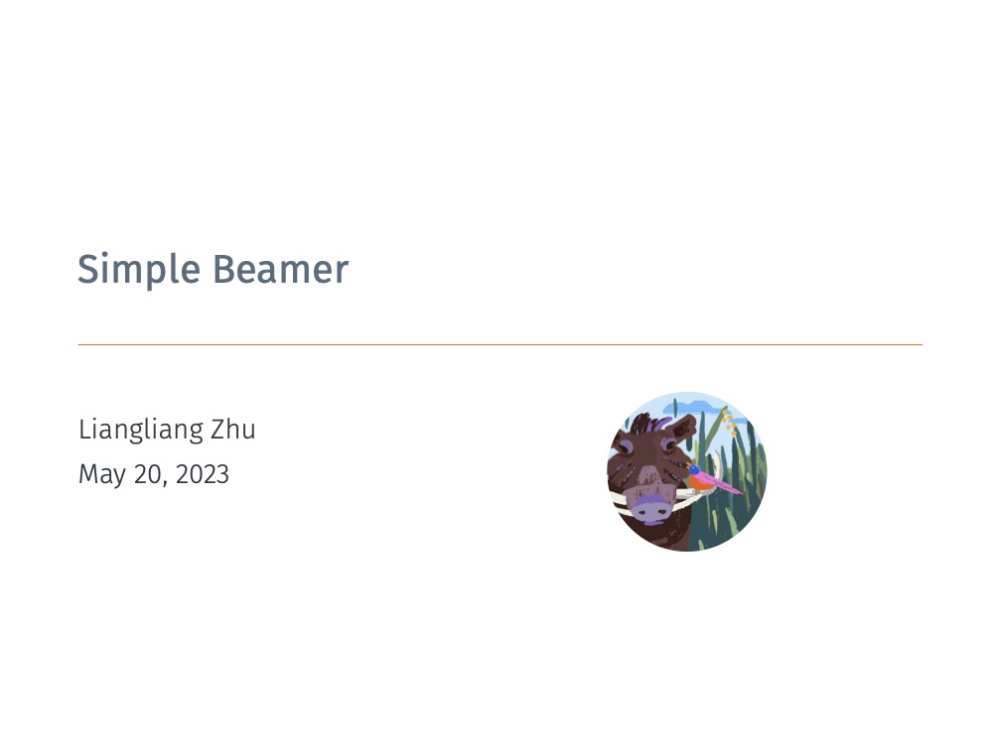

# Simple Beamer


## 介绍
Simple Beamer 是我基于 `metropolis` 修改的一个专用于学术汇报的 `Beamer` 模版。Simple Beamer 内置了公式、图片、参考文档等学术写作相关的包。同时支持中英文写作，可以插入圆形logo，内置了多个主题色彩，有丰富的自定义选项，封面效果如下：

<div align=center>
    
</div>

## 使用

可以通过如下`tex`代码使用 Simple Beamer 模版。

```tex
\documentclass[lang=en,aspectratio=43,theme=retro,logo=on]{simplebeamer}
\title{Simple Beamer}
\author{Liangliang Zhu}
\date{\today}

\begin{document}

\maketitle

\begin{frame}{An example frame}
    This is a simple frame using Simple Beamer template.
    \begin{equation}
        x^{2} + 2x + 1 = 0.
    \end{equation}
\end{frame}

\end{document}
```

具体配置选项如下：

- lang（语言）
  - en（英文）
  - cn（中文）
- aspectratio (页面比例)
  - 43 （4比3）
  - 169（16比9）
- theme（主题）
  - default
  - retro
  - dark
  - jet
- mode（编译模式）
  - final （最终版，图片压缩，无行号）
  - preprint（预览版，图片压缩，有行号）
  - nocomp（草稿版，图片不压缩，有行号）
- page（标题页面层级）
  - section（显示section的标题页面）
  - subsection（显示subsection的标题页面，section的不显示）

以上选项的第一个参数都是默认参数。

引用文献时推荐使用`\footfullcite{xxx}`，这样可以直接在页面底部生成文献。当然也可以正常使用`\cite{xxx}`，然后在PPT的最后加上`\printbibliography[heading=simplebeamer]`来生成参考文献页面。

使用说明可以参考[Simple Paper](https://github.com/shinyypig/Simple-Paper/releases)，空白模版到[release](https://github.com/shinyypig/Simple-Beamer/releases)中下载最新版`Simple.Beamer.zip`即可。
